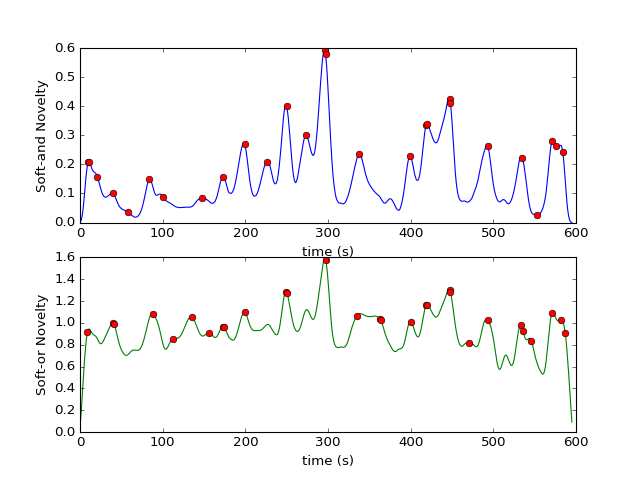

# CS4065 Multimedia Search and Recommendation
## Systems, Assignment 2

Lars Krombeen - 4280709

Tim van der Lippe - 4289439

We used MFCC for the audio, as the self-similarity matrix for the chroma was very noisy and almost uniformly similar,
whereas the MFCC had strong similar areas.
Changing the width of the kernel (default 64) did not result in significant changes in the novelty curve.
The three strongest scene boundaries are: 00:04:57, 00:04:10 and 00:06:56 based on the following novelty curve:

The audio signal was analyzed using the cosine dissimilarity function on the MFCC feature.
The video signal was analyzed using hs_histogram with a gaussian checkerboard kernel of width 32.

* For the first scene change: First the bunny shoots an arrow in the tree, then a black scene change occurs after a grass field is shown.

  The colors transitions from a primarily white bunny with trees, to a full black screen and then a green grass field with primarily green trees.
Thus it transitions from dark to lighter green.

  For the music, there is first very lively music which excites the audience, with a high-tone end with no music during the scene-change.
  Then, there is softer music and some rustle sounds from the squirrels moving in the grass.

* Second scene change: First the bunny is shown holding an vine in a closeup setup, then a branch is shown in fullscreen which the bunny grabs and pulls. In this case, the bunny realizes how he can catch the squirrel and the other animals.

  First the scene is a bit dark, as the white bunny is beneath the trees.
  A lot of gray colors are in this scene, as well as darker green.
  Then after the change, the scene is a lot lighter with more blue tints.

  The music at first is somewhat mystic with a flute signaling the scene change.
  Then there is more percussion with lower notes from the horns.
* Third scene change: A view looking straight up alongside a tree showing a peach falling to the ground. Then you see the squirrel sitting on a branch of a tree, jumping away.

  The shot with the falling peach shows the dark green leaves of the tree with predominantly more orange of the peach as well as blurrying the background.
  When the squirrel jumps, it shows a lightblue background with gray branches and a lightbrown squirrel.

  The music at first has a lot of violins and higher notes.
  While the peach is falling, a low dark sound gets louder and louder with a low bang when the peach falls on the ground.

### Ideas

Since the video is posted on Youtube, there is social media data available of viewers who pinpoint specific timestamps in the video.
These timestamps are very likely to depict scene changes, as they usually indicate when a certain action is starting that they are commenting on.
Thus, extracting these timestamps could help in detecting actions that are unique.

You can apply face detection to collect the different actors in each scene.
If suddenly the set of actors changes, there is probably a scene change as well.
You could also do this with objects, although we are not certain how to actually detect certain objects.
